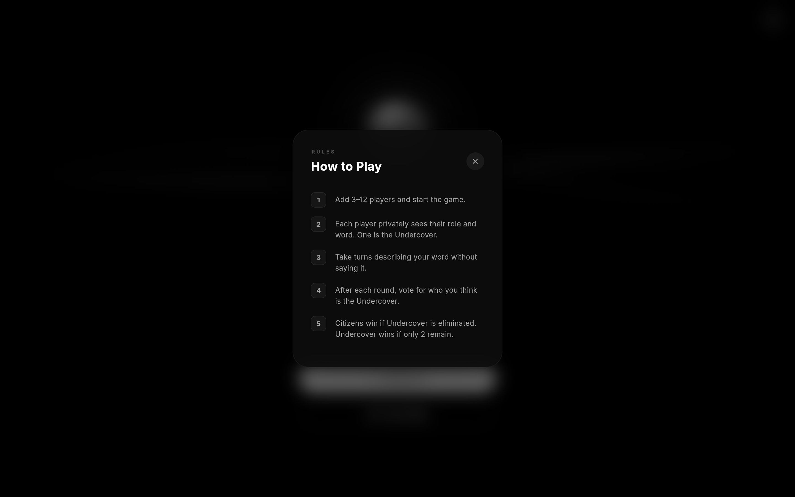
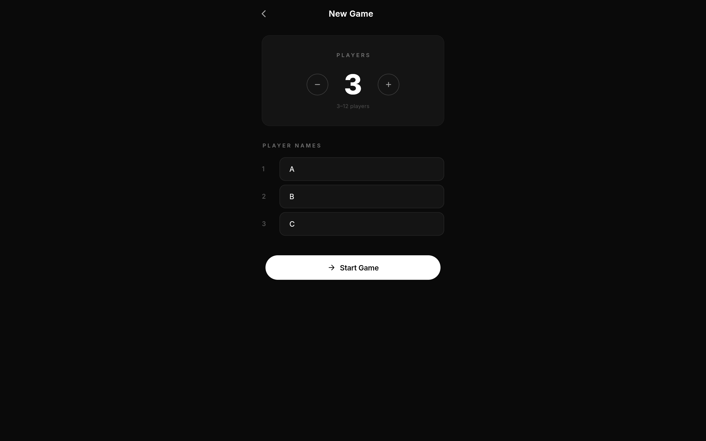
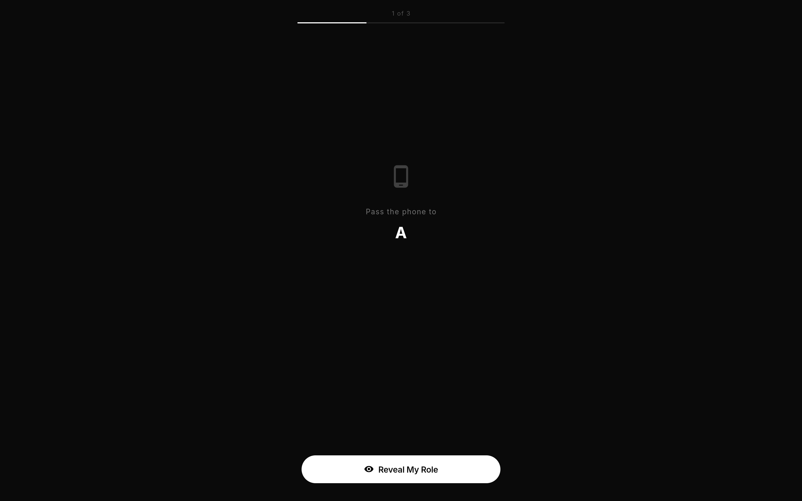
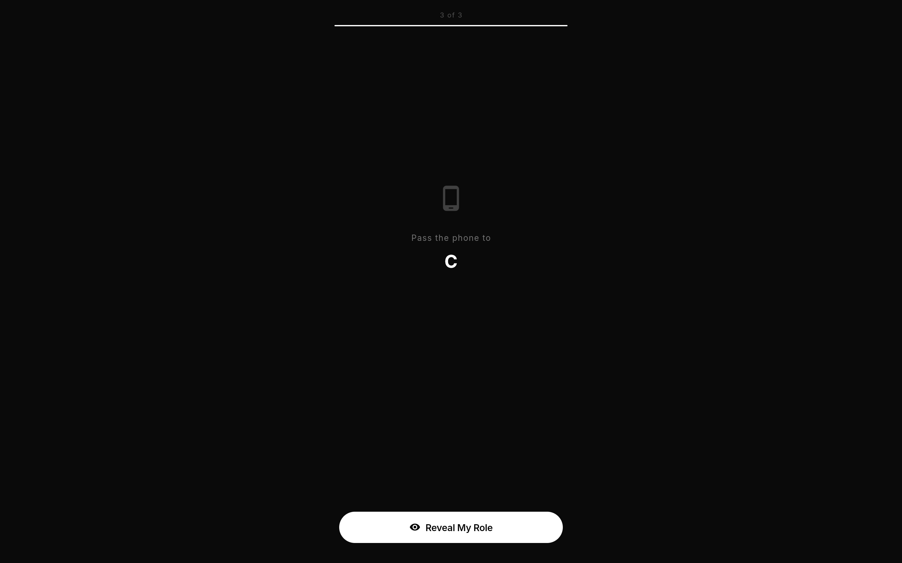
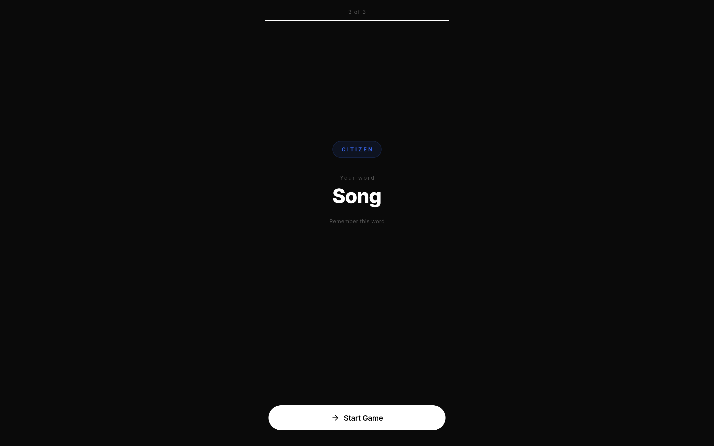
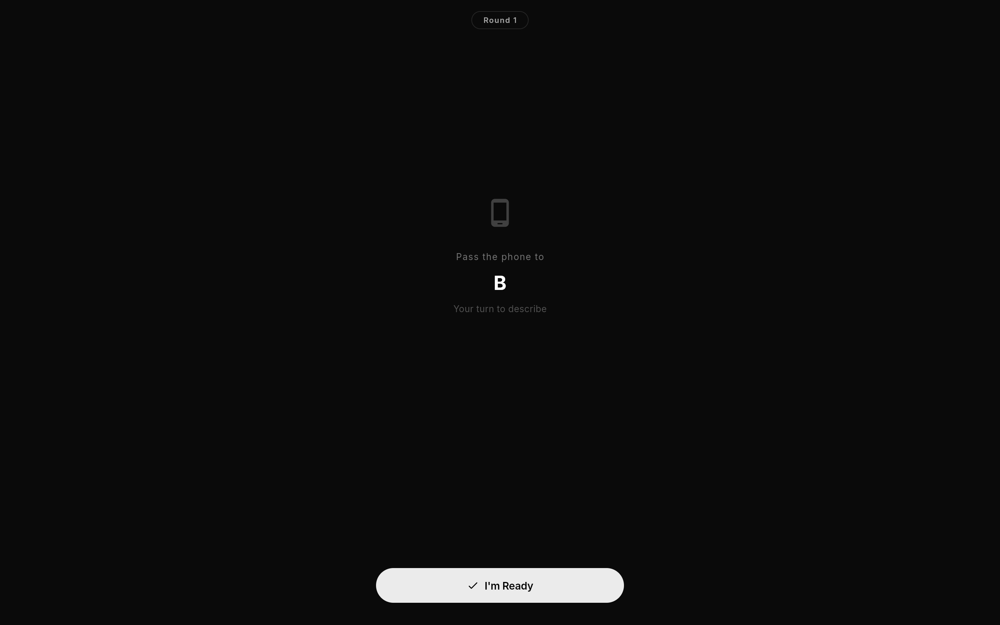
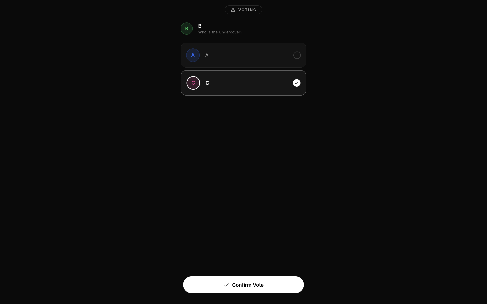
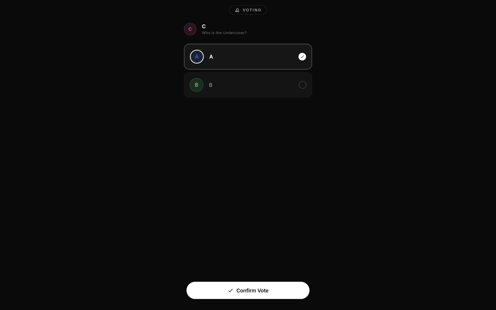
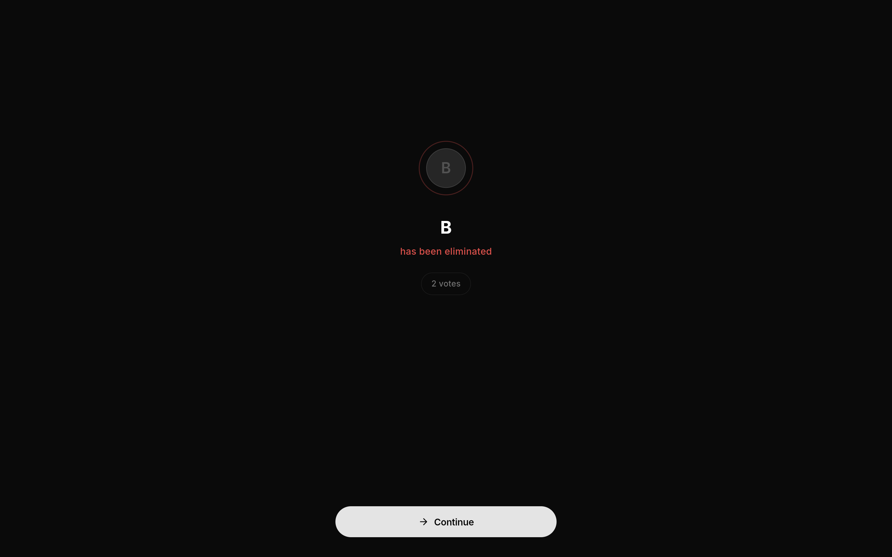

# Undercover — Social Deduction Party Game

A production-quality Flutter party game based on the classic social deduction game *Undercover*. Players gather around a single device, receive secret roles and words, describe them in turns, and vote to eliminate the suspected impostor.

Built with clean architecture, modular code structure, and designed for scalability.

---

## Table of Contents

- [Getting Started](#getting-started)
- [Running the App](#running-the-app)
- [Gameplay Walkthrough](#gameplay-walkthrough)
- [Architecture Overview](#architecture-overview)
- [Project Structure](#project-structure)
- [Tech Stack](#tech-stack)
- [Design Decisions](#design-decisions)
- [Scalability and Future Roadmap](#scalability-and-future-roadmap)
- [Author](#author)

---

## Getting Started

### Prerequisites

- Flutter SDK (latest stable, 3.x+)
- Dart SDK (bundled with Flutter)
- Firebase CLI (for Firebase integration)
- Chrome (for web), Xcode (for iOS), or Android Studio (for Android)

### Installation

```bash
git clone https://github.com/your-username/undercover_game.git
cd undercover_game
flutter pub get
```

### Firebase Setup

The project uses Firebase for session persistence and is pre-configured. If you need to reconfigure:

```bash
dart pub global activate flutterfire_cli
flutterfire configure
```

Environment variables are stored in `.env` (not committed to version control).

---

## Running the App

### Web

```bash
flutter run -d chrome
```

### Android

```bash
flutter run -d android
```

Ensure a physical device is connected via USB with developer mode enabled, or an Android emulator is running.

### iOS

```bash
cd ios && pod install && cd ..
flutter run -d ios
```

Requires Xcode installed on macOS. For physical devices, configure signing in Xcode under `Runner.xcworkspace`.

### macOS

```bash
flutter run -d macos
```

---

## Gameplay Walkthrough

The game follows a structured flow designed for real-life party play with a single shared device.

### 1. Welcome Screen


The app opens with a cinematic welcome screen featuring an animated crystal orb and ambient background music. The player taps "Enter" to proceed and activate the audio experience.

### 2. Home Screen


The main menu provides two options: start a new game or view the rules. The interface features a floating orb with procedurally animated smoke, flowing ribbon visuals rendered via CustomPainter, and a mute toggle for background music.

### 3. How to Play



A glassmorphic overlay explains the game rules in five concise steps. The overlay uses backdrop blur and staggered entry animations for each rule item.

### 4. Player Setup



Players configure the game by selecting the number of participants (3 to 12) and entering each player's name. Validation ensures all names are filled and unique before proceeding.

### 5. Role Distribution — Private Reveal

Each player views their assigned role and secret word privately using a pass-the-phone flow.



The device prompts the group to pass it to the next player. Only when that player taps "Reveal My Role" does their secret information appear.


Player A is assigned the Undercover role with the word "Poem". The role badge and word are displayed prominently with color-coded indicators (red for Undercover, blue for Citizen).


Player B is a Citizen with the word "Song". Citizens receive one word from the pair while the Undercover receives the related but different word.



The flow continues until all players have privately viewed their roles.



Player C is also a Citizen with the word "Song".

### 6. Game Round — Word Description

Players take turns describing their secret word without saying it directly.


The device is passed to each player with a prompt to begin their turn.


The active player describes their word verbally to the group. The screen shows instructions and a progress indicator of remaining turns.



After finishing, the player taps "Done" and the device transitions to the next player.


Player B takes their turn describing their word.


The flow continues through all active players.


Once all players have described their words, the game transitions to the voting phase.

### 7. Voting Phase

Each player privately votes for who they suspect is the Undercover.


The pass-the-phone flow is repeated for voting.


Player A selects their suspect from the list of other active players. A radio-style selection indicator confirms the choice before submission.


The device is passed to the next voter.



Player B casts their vote.


Final voter receives the device.



Player C casts the final vote of the round.

### 8. Elimination or Tie


If votes are evenly split, no player is eliminated and the game proceeds to the next round. This prevents unfair eliminations and adds strategic depth.



In subsequent rounds, the player with the most votes is eliminated. The elimination screen shows the player's name and vote count.

### 9. Game Result


The game ends when a win condition is met. Citizens win if the Undercover is eliminated. The Undercover wins if only two players remain. The result screen reveals the Undercover's identity, the word pair used, and provides options to play again or return to the main menu.

---

## Architecture Overview

The project follows a modular, layered architecture with clear separation of concerns:

- **Models** define data structures (Player, GameSession, WordPair) with JSON serialization for persistence.
- **Repositories** handle data access. `GameRepository` provides both local storage via SharedPreferences and Firestore integration for cloud persistence.
- **Services** contain pure game logic with zero Flutter dependencies. `GameService` handles role assignment, vote processing, and win condition evaluation. This separation allows the game logic to be unit tested independently.
- **Controllers** (GetX) bridge services to the UI layer. Each game phase has its own controller managing reactive state.
- **Views** are lightweight widgets that observe controller state and render UI. No business logic lives in views.
- **Widgets** are reusable UI components shared across views.

This architecture was chosen to keep each layer independently testable and to make the codebase straightforward to extend — for example, swapping local storage for a real-time backend requires changes only in the repository layer.

---

## Project Structure

```
lib/
├── main.dart                                  # App entry point, Firebase init
├── firebase_options.dart                      # Auto-generated Firebase config
│
├── app/
│   ├── routes/
│   │   ├── app_routes.dart                    # Route name constants
│   │   └── app_pages.dart                     # GetX route-to-page bindings
│   └── themes/
│       └── app_theme.dart                     # Dark theme, typography, input styles
│
├── core/
│   ├── constants/
│   │   ├── app_colors.dart                    # Color palette (black, white, gray, blue, red)
│   │   ├── app_strings.dart                   # All user-facing text
│   │   ├── app_dimens.dart                    # Spacing, radius, font sizes, max width
│   │   └── constants.dart                     # Barrel export
│   └── services/
│       ├── game_service.dart                  # Pure game logic (no Flutter imports)
│       ├── game_controller.dart               # GetX controller bridging GameService to UI
│       └── music_service.dart                 # Background music playback, fade in/out
│
├── data/
│   ├── models/
│   │   ├── word_pair.dart                     # WordPair with JSON serialization
│   │   ├── player.dart                        # Player model, roles, voting state
│   │   ├── game_session.dart                  # Session state, status, result enums
│   │   └── models.dart                        # Barrel export
│   └── repositories/
│       ├── word_pair_repository.dart           # 35+ predefined word pairs, 6 categories
│       ├── game_repository.dart                # Local (SharedPreferences) + Firestore storage
│       └── repositories.dart                   # Barrel export
│
├── widgets/
│   ├── animated_background.dart               # Base dark background container
│   ├── glass_card.dart                        # Card component with border styling
│   ├── gradient_button.dart                   # Filled and outlined button variants
│   ├── player_avatar.dart                     # Circular avatar with color from name hash
│   └── widgets.dart                           # Barrel export
│
└── modules/
    ├── setup/
    │   ├── controllers/
    │   │   ├── home_controller.dart            # Home screen animation and state logic
    │   │   └── setup_controller.dart           # Player count, names, validation
    │   ├── views/
    │   │   ├── home_view.dart                  # Home screen composition (orb, ribbon, buttons)
    │   │   ├── home_welcome_overlay.dart       # Welcome screen with enter button
    │   │   └── setup_view.dart                 # Player configuration screen
    │   └── widgets/
    │       ├── orb_widget.dart                 # Crystal orb with radial gradient
    │       ├── smoke_painter.dart              # CustomPainter for smoke blobs inside orb
    │       ├── ribbon_painter.dart             # CustomPainter for flowing ribbon strands
    │       └── how_to_play_overlay.dart        # Rules overlay with backdrop blur
    │
    ├── role_reveal/
    │   ├── controllers/
    │   │   └── role_reveal_controller.dart     # Pass-phone flow, reveal toggle, navigation
    │   └── views/
    │       └── role_reveal_view.dart           # Private role and word display
    │
    ├── game_round/
    │   ├── controllers/
    │   │   └── game_round_controller.dart      # Turn management, round progression
    │   └── views/
    │       └── game_round_view.dart            # Description phase UI
    │
    ├── voting/
    │   ├── controllers/
    │   │   └── voting_controller.dart          # Vote collection, tally, elimination logic
    │   └── views/
    │       ├── voting_view.dart                # Player selection for voting
    │       └── elimination_view.dart           # Elimination result or tie display
    │
    └── result/
        ├── controllers/
        │   └── result_controller.dart          # Win condition display, replay/menu navigation
        └── views/
            └── result_view.dart                # Final result screen with word pair reveal

assets/
├── background_music.mp3                        # Ambient cinematic background track
└── screenshots/                                # App screenshots for documentation
```

---

## Tech Stack

| Layer              | Technology                  | Purpose                                      |
|--------------------|-----------------------------|----------------------------------------------|
| Framework          | Flutter 3.x                 | Cross-platform UI                            |
| State Management   | GetX                        | Reactive state, navigation, DI               |
| Backend            | Firebase (Firestore)        | Session persistence, online-ready             |
| Local Storage      | SharedPreferences           | Offline game state persistence               |
| Audio              | audioplayers                | Background music with fade effects           |
| Fonts              | Google Fonts (Inter)        | Clean, modern typography                     |
| Animations         | flutter_animate             | Declarative animation chains                 |
| Custom Graphics    | CustomPainter               | Orb smoke, flowing ribbon visuals            |
| IDs                | uuid                        | Unique player and session identifiers        |

---

## Design Decisions

**Offline-first approach.** The game stores state locally via SharedPreferences, ensuring it works without internet connectivity. Firebase integration is present and functional for session persistence, but is not required for gameplay. This was a deliberate choice to match the real-world use case: party games are often played in environments with unreliable connectivity.

**Pure game logic separation.** `GameService` contains all game rules — role assignment, vote tallying, win condition checks — with zero Flutter dependencies. It operates on plain Dart objects and can be tested in isolation. The `GameController` layer wraps this service with GetX reactivity for the UI.

**Module-per-phase structure.** Each game phase (setup, role reveal, game round, voting, result) has its own module with dedicated controller and view. This prevents any single file from growing unwieldy and makes it straightforward to modify one phase without affecting others.

**Pass-the-phone privacy model.** Since this is a local multiplayer game on a single device, the role reveal and voting phases use an explicit pass-the-phone flow. Players see a prompt to hand the device to the next person before any sensitive information is displayed. This prevents accidental role exposure.

**CustomPainter for visuals.** The home screen orb and ribbon effects use Flutter's CustomPainter with continuous time-based animation. Irrational speed ratios between visual elements ensure the animation never visibly loops, creating an organic, procedural feel.

**Scope adherence.** The implementation follows the provided task requirements precisely. Additional features such as online multiplayer rooms, multi-language support, and AI-powered hint systems were intentionally deferred to avoid introducing complexity beyond the defined scope. These are detailed below as a roadmap for future development.

---

## Scalability and Future Roadmap

The architecture was designed with extensibility in mind. Below are concrete expansion paths that require minimal structural changes.

### Online Multiplayer

The current game runs locally on a single device. Transitioning to online play would involve:

- **Room system.** One player creates a room and receives a shareable room ID and QR code. Other players join by scanning or entering the code.
- **Real-time sync.** Firebase Realtime Database or Firestore listeners can synchronize game state across devices. The existing `GameRepository` already implements Firestore methods (`saveSessionToFirestore`, `watchSession`) that serve as a foundation.
- **Alternative backends.** For higher control, a custom backend using Node.js with Socket.io and MySQL/PostgreSQL could replace Firebase. The repository abstraction layer means swapping the data source requires changes only in `game_repository.dart`.

### Multi-Language Support

The project centralizes all user-facing strings in `app_strings.dart`. Adding localization involves:

- Replacing static strings with Flutter's `intl` package or GetX translations.
- Supporting per-player language preferences so each player sees the interface in their own language.
- Integrating a translation layer for word descriptions — when a player describes their word, the system could translate the description for other players who use a different language. This could leverage a translation API or an on-device ML model.

Supported languages could include English, Arabic, Turkish, Finnish, Chinese, and others based on the player base.

### AI Integration

Several AI-powered features could enhance gameplay:

- **Smart word pairs.** An LLM generates contextual word pairs with adjustable difficulty, replacing the static predefined list.
- **Description analysis.** AI evaluates player descriptions to detect if someone accidentally said their word or gave an overly specific hint, adding an automated moderation layer.
- **AI players.** For groups smaller than 3, AI-controlled players could fill remaining slots, generating descriptions and casting votes based on the game state.

### Additional Game Modes

- **Multiple Undercovers.** Scale the Undercover count based on player count for larger groups.
- **Blank role.** A player who receives no word at all and must bluff their way through.
- **Timed rounds.** Add a countdown timer for descriptions to increase pressure.
- **Custom word packs.** Let players create and share their own themed word pair collections.

---

## Author

Mohammed Saleh